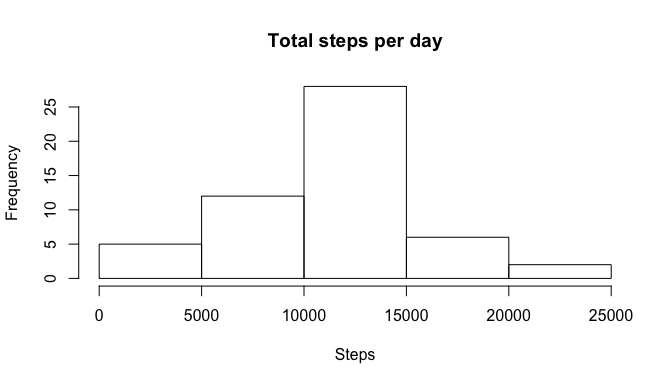
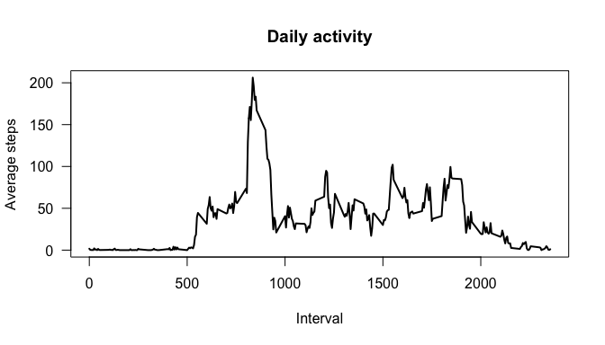
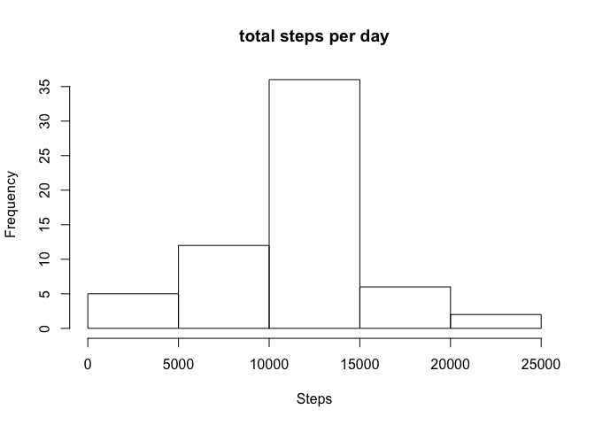
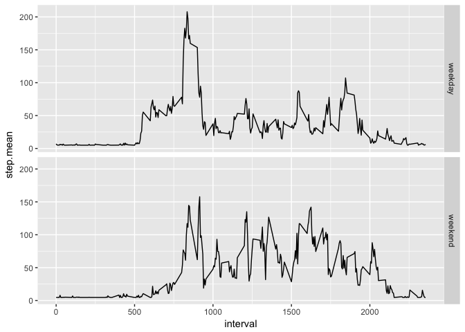

## Loading and preprocessing the data


```r
dataset = read.csv('./activity.csv')
dataset2 = dataset[!is.na(dataset$steps), ]
head(dataset2)
```

```
##     steps       date interval
## 289     0 2012-10-02        0
## 290     0 2012-10-02        5
## 291     0 2012-10-02       10
## 292     0 2012-10-02       15
## 293     0 2012-10-02       20
## 294     0 2012-10-02       25
```


## What is mean total number of steps taken per day


```r
sum.step = with(dataset2, tapply(steps, date, sum))
hist(sum.step, main="total steps per day", xlab='Steps')
```

<!-- -->

```r
mean.step = format( mean(sum.step, na.rm=TRUE), nsmall=2)
med.step  = median(sum.step, na.rm=TRUE)
```

Mean steps taken per day is 10766.19. Median steps taken per day is 10765.


## What is the average daily activity pattern?


```r
ave.step = with(dataset2, tapply(steps, interval, mean))
plot(names(ave.step), ave.step, type="l", lwd=2, las=1,
     xlab = 'Interval', ylab = 'Average steps',  main='Daily activity')
```

<!-- -->

```r
max.interval = names(which.max(ave.step))
```

Among all the 5-minutes intervals, the interval which contains the maximum average steps was 835. 


## Imputing missing values

```r
na.num <- sum(is.na(dataset$steps))

dataset3 = dataset
dataset3$steps[is.na(dataset3$steps)] = mean(dataset2$steps)

sum.step2 = with(dataset3, tapply(steps, date, sum))
hist(sum.step2, main="total steps per day", xlab = 'Steps')
```

<!-- -->

```r
mean.step2 = format( mean(sum.step2), nsmall=2)
med.step2  = format( median(sum.step2, nsmall=2) )
```
The number of missing value in dataset was 2304.   

After imputing missing data, mean steps taken per day became 10766.19, and median steps taken per day became 10766.19.   

The mean and mediam were not affected so much but the shape of histgram became sharper distribution than previous histgram as the missing values were replaced with average of total taily numper of steps.   


## Are there differences in activity patterns between weekdays and weekends?


```r
library(dplyr)
library(ggplot2)

dataset3$days = factor(1*(weekdays(as.Date(dataset3$date)) %in% c('Sunday', 'Saturday')),
                       label=c('weekday', 'weekend'))

ds <- dataset3 %>%
        group_by(days, interval) %>%
            summarise( step.mean = mean(steps)) 

ggplot(ds, aes(interval, step.mean)) + geom_line() + facet_grid(days~.)
```

<!-- -->
